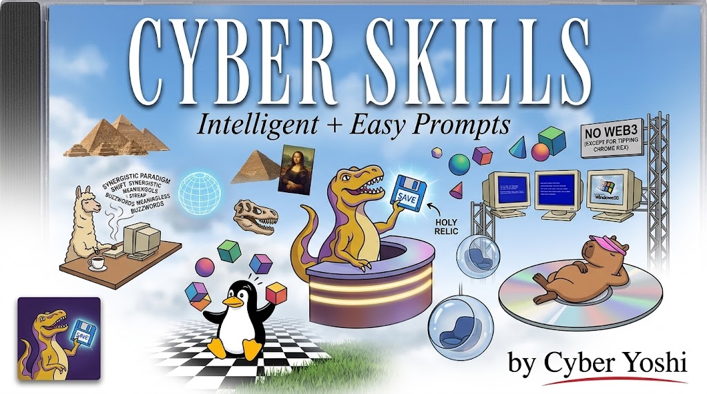
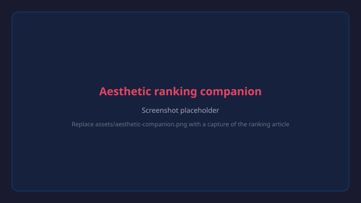

<div align="center">



**Prompts verificados, hechos por un nerd determinista con sentido del humor**

[](https://github.com/yoshi-ortiz/cyber-skills/releases)
[](https://github.com/yoshi-ortiz/cyber-skills)
[](#-colección)
[](#-experimentos)
[](tools/CONTEXT.md)

🇬🇧 [English](README.md) | 🇪🇸 **Español** | 🇯🇵 日本語 (próximamente)

Solo Python estándar · Listo para usar

</div>

---

## 🤔 ¿Te sirve esto?

Pregúntale a lo mismo donde lo vas a instalar. Pega esto en Claude Code,
Cursor o la app de IA que uses. Lee el repositorio, te dice qué hace cada
prompt y te acompaña a instalar los que quieras.

```
What's this plugin for? Should I install it?
https://github.com/yoshi-ortiz/cyber-skills
```

Un **skill prompt** es un paquete de prompts definidos que tu
agent lee antes de responderte. El mismo agent, otro especialista:
uno que ya sabe cómo trabajas y no necesita que se lo expliques cada mañana.

No hace falta programar para usarlo. Instalas una carpeta, abres un chat nuevo y
dices su nombre. Todo lo que viene después de la instalación es lectura opcional.

- [Índice y flujo principal](#-colección)
- [Índice de superficies](SKILL_SPEC.md)
- [Instalación](#-instalar)
- [Skills](#-skill-prompts)
- [Próximamente](#-experimentos)

## 📒 COLECCIÓN

Agrupadas por cuándo las necesitas, no por qué tan terminadas están. La
colección sigue un solo riel: `kit` es el Día 0, `first`, `build` y `land`
avanzan el trabajo, y `check` y `fix` son arcos de regreso. La columna
**Familia** dice a qué parada del riel pertenece cada prompt.

<table>
  <colgroup>
    <col width="220">
    <col>
    <col width="230">
  </colgroup>
  <tr><td colspan="3" align="center"><h3><a href="#-kit">📀 Configurar una vez</a><br><small>Instálalo una vez y todas tus apps de IA lo llevan</small></h3></td></tr>
  <tr><td nowrap>📦 <a href="#-kit"><strong>/kit</strong></a></td><td>Un solo juego de herramientas en todas tus apps de IA</td><td><code>kit</code> · <strong>Día 0</strong>, fuera del flujo</td></tr>
  <tr><td nowrap>📦 <a href="#-kit"><strong>/starter-pack</strong></a></td><td>La misma skill, con su nombre original</td><td><code>kit</code> · <strong>Día 0</strong>, fuera del flujo</td></tr>
  <tr><td nowrap>😆 <a href="#-silly"><strong>/silly</strong></a></td><td>Deja que una skill responda a un segundo nombre, en tu idioma o solo uno más bonito</td><td>Sin familia. Sirve en cualquier parada.</td></tr>
  <tr><td nowrap>🇪🇸 <a href="#-silly"><strong>/silly</strong></a> español</td><td>Agrega comandos en español</td><td>Sin familia. Sirve en cualquier parada.</td></tr>
  <tr><td nowrap>🇪🇸 <a href="#-ora"><strong>/ora</strong></a></td><td>Reescribe las conclusiones de tu agent en español sencillo</td><td>Sin familia. Sirve en cualquier parada.</td></tr>
  <tr><td colspan="3" align="center"><h3><a href="#-genesis">💼 Planear</a><br><small>Antes de empezar a construir</small></h3></td></tr>
  <tr><td nowrap>📁 <a href="#-genesis"><strong>/genesis</strong></a></td><td>Planea antes de construir, y comprueba que funcione</td><td><code>first</code> · <strong>Planear</strong></td></tr>
  <tr><td nowrap>📚 <a href="#-enciclopedia"><strong>/enciclopedia</strong></a></td><td>Lee la documentación real y guarda una nota corta con su fuente</td><td><code>first</code> · <strong>Planear</strong></td></tr>
  <tr><td colspan="3" align="center"><h3><a href="#-aesthetic">🤖 Sesiones de tokens</a><br><small>Donde se te va una sesión de trabajo</small></h3></td></tr>
  <tr><td nowrap>🧑‍🎨 <a href="#-aesthetic"><strong>/aesthetic</strong></a></td><td>Dibuja opciones de diseño, tú las ordenas y aprende qué te mueve</td><td><code>first</code> · <strong>Planear</strong></td></tr>
  <tr><td nowrap>🔬 <a href="#-build-context-token-vectors"><strong>/build-context-token-vectors</strong></a></td><td>Muestra a qué otros skills se parece el tuyo, y cuál no se parece a nada</td><td><code>build</code> · <strong>Medir</strong></td></tr>
  <tr><td colspan="3" align="center"><h3>🛤️ Resto del riel<br><small>Familias planeadas. Todavía no hay comando instalado que responda a estos nombres.</small></h3></td></tr>
  <tr><td nowrap>🔨 <code>build-*</code></td><td>Implementa y verifica el contrato aprobado</td><td><code>build</code> · <strong>Código · Build · Pruebas</strong></td></tr>
  <tr><td nowrap>🚢 <code>land-*</code></td><td>Publica salidas y vuelve observable el despliegue</td><td><code>land</code> · <strong>Lanzar · Desplegar</strong></td></tr>
  <tr><td nowrap>🔍 <code>check-*</code></td><td>Lee el progreso y la evidencia de producción y los devuelve a planeación</td><td><code>check</code> · <strong>Monitorear</strong> → Planear</td></tr>
  <tr><td nowrap>🩹 <code>fix</code></td><td>Restaura la operación y vuelve a la familia afectada</td><td><code>fix</code> · <strong>Operar</strong>, respuesta a incidentes</td></tr>
</table>

Las versiones estables están en [SKILL PROMPTS](#-skill-prompts). El resto
son [EXPERIMENTOS](#-experimentos), de instalación manual.

El [índice de superficies](SKILL_SPEC.md) conecta cada familia, alias, dueño,
estado e item del roadmap. Los nombres planeados todavía no son comandos
instalables.

---

# 📦 INSTALAR

Un solo comando. Encuentra todas tus apps de IA e instala en cada una. Sin
clonar, sin carpetas, sin configurar nada.

**Todo, experimentos incluidos:**

```bash
npx skills add https://github.com/yoshi-ortiz/cyber-skills/tree/dev -g --all
```

**Solo lo estable:**

```bash
npx skills add yoshi-ortiz/cyber-skills -g --all
```

Después abre un **chat nuevo**. Las apps de IA leen sus skills al empezar una
conversación, nunca a mitad de camino. Eso es toda la instalación.

<details>
<summary><b>Instalar menos que todo</b></summary>

`--all` es un atajo de `--skill '*' --agent '*' -y`, o sea todas las skills en
todas las apps y sin preguntas. **No** incluye `-g`, así que sin eso las skills
caen en la carpeta donde tengas parada la terminal y ninguna app las encuentra.
Deja el `-g`. Cada opción de abajo reduce una parte de eso.

| Opción | Qué hace |
| --- | --- |
| `-s`, `--skill <nombre>` | Una sola skill, por su carpeta. Repetible. |
| `-a`, `--agent <id>` | Una sola app de IA: `claude-code`, `cursor`, `codex`, `opencode`, `zed`, `pi` o `antigravity`. Repetible. |
| `-g`, `--global` | Instala para tu usuario, no para un solo proyecto |
| `-l`, `--list` | Imprime lo que hay, no instala nada |
| `-y`, `--yes` | Omite la confirmación por su cuenta |

`yoshi-ortiz/cyber-skills` a secas lee la rama `main`, que lleva solo las
skills estables. La URL con `/tree/dev` lee la rama de desarrollo, que lleva
esas más todo lo que está en EXPERIMENTOS.

Las skills caen en `~/.agents/skills/`. Claude Code y Pi quedan enlazados
desde ahí por el CLI. **Cursor, Codex y Antigravity no**, así que si usas
alguno de esos y las skills no aparecen, por eso es. [/kit](#-kit) instala el
puente que cierra ese hueco y lo vuelve a correr después de cada instalación.

Para quitar una después: `npx skills remove <nombre>`.

</details>

---

# ✨ SKILL PROMPTS

Estables. Se instalan con la ruta B, tienen soporte y puedes confiar en ellas.

## 🔬 /build-context-token-vectors

Responde una pregunta: **¿a qué otros skills se parece el tuyo?** Lee cada
skill instalado en tu máquina, los agrupa por lo que dicen, y te muestra dónde
cae el tuyo. Algunos caen junto a vecinos evidentes. Otros no caen en ninguna
parte, y eso conviene saberlo antes de dar por hecho que el tuyo es único.

| | |
| --- | --- |
| **Package** | [build-context-token-vectors/](build-context-token-vectors/) · entry [build-context-token-vectors/SKILL.md](build-context-token-vectors/SKILL.md) |
| **Invocar** | Solo tú. Di `build-context-token-vectors`. |
| **Necesita** | Python, y tres paquetes en un entorno desechable que creas tú: `evoc`, `model2vec`, `matplotlib` |
| **Se ejecuta en** | Tu carpeta de skills instalados, solo lectura |
| **Canal** | `main` |

<details>
<summary><b>Spec completa: qué mide, y lo único que se niega a decir</b></summary>

`tools/token_bench.py` compares a skill flow against a reference flow, and a
human picks the reference. This derives it instead: every `SKILL.md` becomes a
vector, the vectors are clustered, and the nearest neighbours are the skills a
benchmark should actually run against.

| Output | Means |
| --- | --- |
| Cosine similarity | How close two skills' doctrine sits. Above 0.80 a real peer, 0.65 to 0.80 a loose one, below 0.65 no peer at all. |
| A cluster | The skill was placed, and that cluster's other members are its neighbourhood. |
| `noise` | It was placed nowhere. |
| The scatter plot | Two principal components, for orientation. Clustering ran in full dimensionality, so two adjacent looking points may not be. |

**It never says whether a skill is good.** `noise` means the corpus holds no
peer, and novelty and dilution look identical from here. The judgement stays
yours.

**The seed is part of the result.** The clustering algorithm is stochastic, so
the script declares a fixed `random_state`. Without one, two runs over the same
skills return different groups, and a comparison set that moves is not one.

**Dependencies stay outside.** Nothing in this package imports them except this
skill's own script, and it ships none of them.

</details>

## 🧑‍🎨 /aesthetic



Diseño que se lee como **intencional, no como plantilla**. Tu agent dibuja
de 3 a 6 versiones de una pantalla y las publica en una página de tu navegador.
**Tú las ordenas y dejas notas, con tus palabras.** Las lee de vuelta y dibuja
la siguiente ronda contra eso. Nada se califica por vibra.

| | |
| --- | --- |
| **Paquete** | [aesthetic/](aesthetic/) · entrada [aesthetic/SKILL.md](aesthetic/SKILL.md) |
| **Invocación** | Tu agent la inicia cuando el trabajo es visual. También puedes nombrarla. |
| **Requiere** | Python 3 (solo estándar) · Node para la página local de ranking |
| **Trabaja sobre** | **Tu** carpeta de proyecto, nunca este repositorio |
| **Canal** | `alpha` |

La primera respuesta debería ser: una URL, una clave de sesión y una pregunta.
Si abre con charla de configuración, eso es un bug.

<details>
<summary><b>Especificación completa: modos, scripts, doctrina y puerta de entrada</b></summary>

**Modos**, se dicen en el chat, no se escriben como banderas.

| Modo | Cuándo |
| --- | --- |
| `continue` | Retoma desde el registro. Una ronda nueva de 3 a 6 elementos. |
| `critique` | Reporta desajustes sin cambiar rangos ni alcance |
| `prototype` | Dibuja y publica propuestas para ordenar |
| `observe` | Ingiere una carpeta de referencia como evidencia |

```bash
python3 aesthetic/scripts/bootstrap_harness.py init --project-root <proyecto>
python3 aesthetic/scripts/bootstrap_harness.py open --project-root <proyecto>
```

`bootstrap_harness.py` maneja el compañero, el registro, el artículo y la
publicación. `editorial_workflow.py` maneja corpus, preferencias, dirección y
pendientes. Seis scripts más cubren reglas, entrega, briefs y diagnóstico. Todos
responden `--help`, y la referencia completa de banderas está en
[references/commands.md](aesthetic/references/commands.md).

**Doctrina.** Autocontenida, OKF 0.2, indexada en
[references/index.md](aesthetic/references/index.md): reglas de oro y
fundamentos de diseño, inferencia y crítica, contratos de producción, y el
modelo de capacidades. Vocabulario:
[UBIQUITOUS_LANGUAGE.md](aesthetic/UBIQUITOUS_LANGUAGE.md). Servidor compañero
en Node: [companion/](aesthetic/companion/).

**Puerta de entrada.** Las insignias de arriba dicen **pending** hasta que esto
se sostenga bajo pruebas de regresión.

| Objetivo | Compromiso |
| --- | --- |
| Ida y vuelta | Tu orden, luego `adopt`, y `preferences` lo refleja sin colapsar la señal |
| Disciplina de ronda | Las rondas publicadas se quedan entre 3 y 6 elementos ordenables |
| Independencia | Estrellas, likes, ciclo de vida y falta de respuesta nunca se funden en un puntaje |
| Accesibilidad | Texto a 4.5:1 y controles a 3:1 de contraste antes de publicar |
| Entrega honesta | `review_delivery.py` rechaza propuestas genéricas, solo explicativas o con hash desviado |
| Fidelidad al tema | La propuesta se reconoce como *este* producto sin el logo |
| Claridad del traspaso | La primera respuesta es URL, clave y una pregunta. Sin preámbulo. |

</details>

## 📦 /kit

Un solo juego de herramientas, todas tus apps de IA. Si usas más de una
IA, esta los mantiene equipados igual, desde una sola lista en vez de una por
una.

| | |
| --- | --- |
| **Paquete** | [kit/](kit/) · entrada [kit/SKILL.md](kit/SKILL.md) |
| **Invocación** | Solo tú. Di `kit` para configurarlo, `kit sync` para actualizarlo y `kit fix` cuando algo se rompió. |
| **También responde a** | `starter-pack`, su nombre original. Viene incluido, no hay que instalarlo. |
| **Requiere** | Git y el checkout de [harness-core](https://github.com/yoshi-ortiz/harness-core) que obtiene |
| **Canal** | `main` |

<details>
<summary><b>Especificación completa</b></summary>

Una skill de referencia: sin scripts, sin estado. Le enseña a un agent a
operar `yoshi-ortiz/harness-core`, cuyo `collection.yaml` lista las skills
y las skills que debería llevar cada app de IA de tu máquina. No instala
runtimes ni administra servidores MCP.

| Argumento | Qué hace |
| --- | --- |
| `kit`, `install`, `setup`, `init`, `start` | Instala el harness y arma cada app de IA. `kit` a secas hace esto. |
| `sync`, `update`, `refresh`, `upgrade` | Vuelve a armar cada app de IA con la lista actual. Esta es la actualización. |
| `fix`, `doctor`, `repair`, `troubleshoot`, `conflict` | Averigua por qué algo se instaló mal, o por qué dos cosas chocaron. |

Instalar una máquina que ya está lista la sincroniza, así que nunca tiene que
preguntarte cuál de las dos querías.

| Cubre | Qué contiene |
| --- | --- |
| Obtener y sincronizar | Clonar o actualizar `harness-core` y ejecutar su script local |
| Dónde vive la lista | El checkout de `harness-core` y la capa local que gana en conflicto |
| Agregar una skill | Por qué editar a mano no instala nada, por qué una lista completa se pudre, por qué `--all` está prohibido |
| Estándar frente a opcional | Lo que recibe cada app de IA, contra los grupos detrás de `--with` |
| Arreglar | Una tabla de síntomas: fuente que falló, copia vieja tras un cambio de nombre, dos skills con un mismo nombre |
| Publicar | Leer el [README de harness-core](https://github.com/yoshi-ortiz/harness-core) para el procedimiento |

</details>

## 🇪🇸 /ora

Reescribe las conclusiones de tu agent en español latinoamericano sencillo:
viñetas cortas, humor ligero, sin rodeos. Los datos, el código y las rutas de
archivo quedan tal cual.

| | |
| --- | --- |
| **Paquete** | [ora/](ora/) · entrada [ora/SKILL.md](ora/SKILL.md) |
| **Invocación** | Solo tú. Di `ora` para empezar y `modo normal` para salir. |
| **Requiere** | Nada. Un solo archivo, sin scripts. |
| **Canal** | `main` |

<details>
<summary><b>Especificación completa</b></summary>

| Disparador | Efecto |
| --- | --- |
| `ora` | Reescribe la siguiente respuesta |
| `ora on` | Se mantiene durante la sesión |
| `ora full` | Traduce la respuesta entera, no solo las conclusiones |
| `ora off` · `modo normal` · `stop ora` | Vuelve a la voz normal |

| Objetivo | Compromiso |
| --- | --- |
| Comprensión | Alguien sin conocimientos técnicos entiende la conclusión a la primera |
| Tiempo de lectura | La respuesta completa se lee en unos 10 segundos |
| Fidelidad | No inventa datos por hacer gracia. Código, rutas y errores quedan literales. |
| Idioma | Español latinoamericano natural, sin colarse al inglés |
| Salida | Termina limpio con `off` |

</details>

---

# 🧪 EXPERIMENTOS

No están en la rama estable. Trabajo real, pruebas reales, bordes sin terminar.
Instálalos a mano desde `dev` (ruta A). Los enlaces de esta sección funcionan en
`dev`.

## 📁 /genesis

Construye como un ingeniero que anota las cosas. Pregunta qué quieres de verdad
antes de tocar código, mantiene una lista viva de qué está listo y qué está
trabado, y **no da nada por terminado hasta verlo funcionar**.

| | |
| --- | --- |
| **Paquete** | [genesis/](genesis/) · entrada [genesis/SKILL.md](genesis/SKILL.md) |
| **Invocación** | Solo tú. Di `genesis`. |
| **Requiere** | Nada. Escribe Markdown normal dentro de tu proyecto. |
| **Trabaja sobre** | **Tu** carpeta de proyecto, nunca este repositorio |
| **Canal** | `alpha` |

<details>
<summary><b>Especificación completa: siete pasos, los archivos que escribe y la puerta de entrada</b></summary>

Se corre al empezar un proyecto, al empezar una función, o al revés como
auditoría de un trabajo que ya va a medias.

| Paso | Qué rechaza |
| --- | --- |
| Entrevistar antes de arquitecturar | Un límite trazado a partir de una petición de una línea |
| Promover el requisito a especificación | Un contrato que cambia mientras construyes contra él |
| Buscar lo que no sabes | Implementar de memoria una dependencia que se mueve rápido |
| Reutilizar antes de escribir | SVG a mano, boilerplate a mano, maquetar a ciegas |
| Construir dentro del límite | Atravesar un módulo a la fuerza para salir del paso |
| Probarlo, y luego decirlo | Un linter en verde reportado como función terminada |
| Actualizar el estado, de inmediato | Un roadmap que solo era cierto el día que se escribió |

**Archivos, en tu proyecto.** `ROADMAP.md` el avance, `BUGS.md` incidentes cada
uno cerrado con su causa raíz, `CHANGELOG.md` versionado semántico,
`docs/REQUIREMENTS.md` en crudo y solo agregando, `docs/SPEC/` los contratos
promovidos, `docs/GLOSSARY.md` un término inmutable por concepto, y
`docs/knowledge/` a cargo de [/enciclopedia](#-enciclopedia).

**Doctrina**, se carga solo cuando un paso la nombra:
[references/index.md](genesis/references/index.md) cubre la entrevista de
alcance y la arquitectura modular, el contrato de reutilización, y qué cuenta
como evidencia.

**Puerta de entrada.** La doctrina está escrita y sin probar.

| Objetivo | Compromiso |
| --- | --- |
| Disciplina de entrevista | Pregunta antes de arquitecturar, incluso ante una petición corta |
| Topología | Un proyecto en frío termina la primera corrida con todos los archivos poblados |
| Fidelidad del estado | Un elemento llega a `DONE` solo con evidencia de ejecución citada en el mismo turno |
| Causa raíz | Ninguna entrada de `BUGS.md` se cierra con un chequeo de nulo si la causa era el flujo de datos |
| Reutilización | Busca una biblioteca de componentes antes de escribir uno, y dice por qué cuando no lo hace |
| Modo auditoría | Apuntado a un proyecto existente, reporta las desviaciones y no cambia nada |

</details>

## 📚 /enciclopedia

Lee el manual para dejar de adivinar. Cuando tu agent necesita saber cómo
funciona alguna herramienta o producto, lo busca, guarda una nota corta **con su
fuente** dentro de tu proyecto, y la próxima vez lee esa nota en vez de
inventarse la respuesta.

| | |
| --- | --- |
| **Paquete** | [knowledge/](knowledge/) · entrada [knowledge/SKILL.md](knowledge/SKILL.md) |
| **Invocación** | Tu agent la inicia cuando hay investigación que conviene guardar. También puedes nombrarla. |
| **Nombre original** | `knowledge`. El nombre en español lo instala [/silly](#-silly). |
| **Requiere** | Python 3 (solo biblioteca estándar) |
| **Trabaja sobre** | **Tu** carpeta de proyecto, nunca este repositorio |
| **Canal** | `alpha` |

<details>
<summary><b>Especificación completa: formato, script y puerta de entrada</b></summary>

Las notas usan **Open Knowledge Format 0.2**: un concepto por archivo,
frontmatter YAML, un `index.md` en la puerta. La especificación queda guardada
en [references/okf-0.2.md](knowledge/references/okf-0.2.md) para no volver a
descargarla. La salida cae en `docs/knowledge/` de **tu** proyecto.

```bash
python3 knowledge/scripts/okf.py new <url> --root docs/knowledge --by claude/opus-5
python3 knowledge/scripts/okf.py check --root docs/knowledge
```

`new` descarga la fuente, escribe el borrador con `resource`, `generated` y
`sources` ya puestos, e imprime el texto extraído. `check` rechaza un archivo
sin frontmatter, uno sin `type`, un concepto que falta en `index.md`, y un
enlace del índice que no resuelve.

El script se detiene antes de resumir, a propósito. Un script que condensara una
página estaría escribiendo justo la parte que tiene que producir algo que
entendió la fuente. Reglas para la mitad humana:
[distilling.md](knowledge/references/distilling.md).

**Puerta de entrada.**

| Objetivo | Compromiso |
| --- | --- |
| Conformidad | Cada nota que escribe pasa `okf.py check` sin retoques a mano |
| Trazabilidad | Ninguna frase de una nota carece de apoyo en las `sources` que declara |
| Compresión | Una nota es más corta que leer con calma su fuente, y aun así responde la pregunta |
| Fidelidad de versión | Se nombra la versión para la que valía la afirmación, y se contrasta con el manifiesto |
| Alcance | Las notas describen fuentes. Las decisiones del proyecto se quedan fuera. |

</details>

## 😆 /silly

Deja que una skill responda a un segundo nombre: `knowledge` en español es
`/enciclopedia`. **Solo se traduce el nombre**, nunca la skill, así que no
hay una segunda copia que se desincronice. Nada se instala hasta que pides un
idioma.

| | |
| --- | --- |
| **Paquete** | [silly/](silly/) · entrada [silly/SKILL.md](silly/SKILL.md) |
| **Invocación** | Solo tú. Di `silly`, o `comandos en espanol`. |
| **Requiere** | Python 3 (solo biblioteca estándar) |
| **Trabaja sobre** | Tu carpeta de skills instaladas, nunca este repositorio |
| **Canal** | `alpha` |

<details>
<summary><b>Especificación completa: el manifiesto, la herramienta y la puerta de entrada</b></summary>

Una skill responde al nombre que dice su propio `SKILL.md` y a ningún otro,
así que un segundo nombre significa un segundo archivo que lo declare. Un enlace
simbólico de carpeta no sirve: el `SKILL.md` de adentro sigue nombrando al
original, y el comando nuevo nunca aparece. Por eso el alias es un archivo
mínimo que apunta a la skill real.

Se declara en la skill que se renombra, nunca en un registro central:

```yaml
translations:
  es: enciclopedia
aliases:
  - nerd-mode
```

Los dos bloques son opcionales. Un nombre declarado tiene que ir en minúsculas,
ser único en el paquete, y **aparecer en la descripción de esa misma
skill**, o el agent nunca ha oído la palabra y el archivo no cambia
nada. La puerta del índice rechaza los tres casos.

```bash
python3 silly/scripts/alias.py list   --root ~/.cursor/skills
python3 silly/scripts/alias.py link   --root ~/.cursor/skills --lang es
python3 silly/scripts/alias.py unlink --root ~/.cursor/skills
```

`link --fun` instala los nombres divertidos. `--dry-run` imprime sin tocar nada.
Se niega a escribir sobre una carpeta que no creó, y `unlink` borra solo sus
propios archivos.

**Declarado hoy:** `knowledge` responde a `enciclopedia` en español.

**Puerta de entrada.**

| Objetivo | Compromiso |
| --- | --- |
| Disparo | Un alias instalado ejecuta la skill real desde un chat nuevo, solo con el nombre |
| Seguridad | Ninguna corrida sobrescribe ni borra una skill que no escribió |
| Opcional | Nada llega a la carpeta sin haberse pedido por idioma o con `--fun` |
| Reversibilidad | `unlink` deja la carpeta exactamente como la encontró |
| Localidad | El manifiesto se queda en la skill que se renombra. Esto nunca se vuelve un registro. |

</details>

---

<div align="center">

Si construyes sobre este trabajo, considera dar atribución CC.

Para contribuir: [CONTEXT.md](CONTEXT.md) · [ROADMAP.md](ROADMAP.md) · [aesthetic/AGENTS.md](aesthetic/AGENTS.md)

</div>
