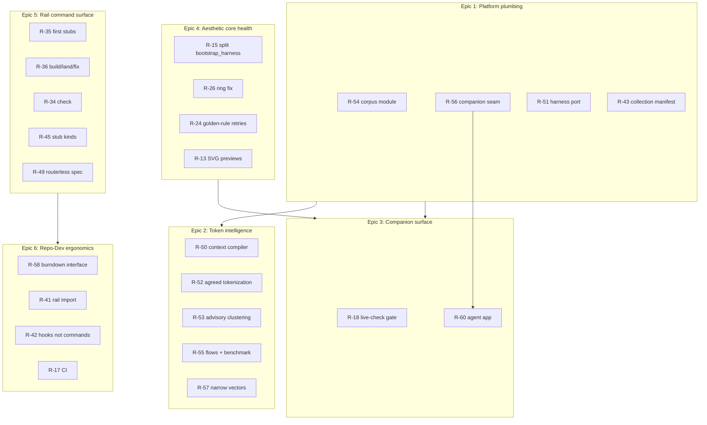

# Roadmap summary and proposed simplification

The burndown has **~35 open rows** across five sections (excluding **E-01 done** and **R-01–R-10 done**). Below is a compressed read, then a proposal to collapse them into **6 epics** and **3 cross-cutting tracks**.

---

## Current snapshot

| Section | Open | In progress | Theme |
| --- | ---: | ---: | --- |
| **Next** (aesthetic harness) | 8 | 0 | Design loop quality, companion, harness size |
| **Corpus and benchmark** | 5 | 0 | Shared plumbing, token cost, dev companions |
| **Rail** | 13 | 2 | Six-family command surface, inference compiler, harness port |
| **Design epics E-02–E-09** | 8 | 0 | Full DES platform (Figma → deploy) |
| **Someday** | 3 | 0 | Language gate, CI, companion agent app |

**In progress today:** R-50 (inference context compiler), R-51 (harness-core Python port).

**Highest coupling:** R-54 → R-55, R-57; R-56 → R-60; R-50 → R-52, R-53; R-36 unlocks most rail stubs.

---

## Open items by theme (condensed)

### Aesthetic harness (`Next`)

| ID | One line |
| --- | --- |
| R-15 | Split `bootstrap_harness.py` (210KB / 30KB budget) |
| R-18 | Companion live-check gates every Loop step |
| R-24 | Cap golden-rule retry cost |
| R-25 | Explicit `subject` in `editorial.json` |
| R-52 | Agreed tokenization: durable verdicts + gate |
| R-53 | Advisory clustering (EVoC, corpus + chunks) |

### Corpus & benchmark

| ID | One line |
| --- | --- |
| R-54 | One module owns skill corpus / frontmatter parsing |
| R-55 | Flows as repo data + benchmark release mode |
| R-56 | Companion seam: share server or gate identical copies |
| R-57 | Narrow `vectors.py` interface |
| R-58 | Burndown query surface (not 5 whole files on entry) |

### Rail & platform

| ID | One line |
| --- | --- |
| R-34 | Write `check` skill (read-only) |
| R-35 | Ship five `first-*` stubs |
| R-36 | Write `build`, `land`, `fix` routers |
| R-37 | Add `design` + `español` modes to `kit` |
| R-38 | Declare `phase` frontmatter |
| R-43 | Index `collection.yaml` + missing sources |
| R-44 | Two pasteable monitor prompts |
| R-45 | Anchor + ghost-argument stub kinds |
| R-46 | Approve-features gate (sketch → build) |
| R-47 | Legibility gate for non-coders |
| R-49 | Record routerless rail in `SPEC.md` |
| R-40 | Measure actual enabled collection per host |
| R-41 | Rail as `CLAUDE.md` import, not commands |
| R-42 | Token rail → statusLine; burndown → stop hook |
| R-50 | Inference context compiler (remaining slice) |
| R-51 | Harness-core: finish Windows parity, drop bash |

### Design platform (existing epics)

E-02 through E-09: brief/contract → inspiration → workspaces → blind control → sketch-to-prod → screenshot TDD → deploy → publish.

### Someday

R-16 (language checker), R-17 (CI), R-60 (superpowers companion agent app for form→file sync).

---

## Proposed simplification: 6 epics

Collapse the flat R-table into epics that match how work actually unblocks.

### Epic 1 — Platform plumbing (foundation)

**Rows:** R-54, R-56, R-51, R-43

**Outcome:** One corpus reader, one companion-server decision, harness fully Python, manifest complete.

**Why group:** R-55 and R-57 explicitly depend on R-54; R-60 blocked on R-56; dogfooding (`kit sync`) depends on R-51 + R-43.

### Epic 2 — Token intelligence (measure → compile → advise)

**Rows:** R-50, R-52, R-53, R-55, R-57, R-40

**Outcome:** Reproducible flows, gated token agreements, advisory clustering, honest host inventory.

**Why group:** All answer GOAL.md's Max/Waste failures with the same toolchain (`direction_context`, `trace_preview`, `vectors`, `token_bench`).

### Epic 3 — Companion surface (browser ↔ durable file)

**Rows:** R-18, R-56, R-60 (+ existing `server.cjs` / `helper.js` contract)

**Outcome:** Companion required before Loop; one server pattern; generalized form-state sync under `.superpowers/`.

**Why group:** R-18, R-56, and R-60 are three faces of the same seam (reachability, duplication, arbitrary HTML inputs).

### Epic 4 — Aesthetic core health (ship quality + pay debt)

**Rows:** R-15, R-26, R-24, R-25, R-13

**Outcome:** Harness under byte budget; known visual defect fixed; gates enforce retry discipline.

**Why group:** All touch `bootstrap_harness.py` / editorial loop; R-15 is the gate before any more features land there.

### Epic 5 — Rail command surface (names users type)

**Rows:** R-35, R-36, R-34, R-37, R-38, R-45, R-46, R-47, R-44, R-49

**Outcome:** Prefix routing fully stubbed; `check`/`build`/`land`/`fix` exist; workflow gaps (approve, legibility) owned.

**Why group:** R-32/R-39 already settled topology; this epic is **implementation of the named surface**, not re-design.

### Epic 6 — Repo-Dev ergonomics (cheaper agent entry)

**Rows:** R-58, R-41, R-42, R-16, R-17

**Outcome:** Query burndown instead of loading 73KB; rail in imports/hooks; language + CI gates.

**Why group:** All attack the same symptom (R-58 measured): Repo-Dev entry costs 2× a full skill walk.

---

## Design epics: simplify to 3 phases

The eight E-rows (E-02–E-09) are correct but heavy for a burndown. Group by **user journey**:

| Phase | Merged epic | Old rows | User-visible outcome |
| --- | --- | --- | --- |
| **Discover & frame** | **E-A: Brief + inspiration** | E-02, E-03, E-04 | Non-coder establishes contract; finds and tags references; opens Figma/Adobe/Canva officially |
| **Build & prove** | **E-B: Blind build loop** | E-05, E-06, E-07 | Preview/undo without Git; sketch→component; screenshot TDD |
| **Ship & publish** | **E-C: Land** | E-08, E-09 | Deploy with observability; publish only selected deliverables |

Cross-cutting **E-01 done** remains the contract shell everything hangs on.

---

## Suggested priority order (if simplifying execution)

1. **Epic 1** (R-54, R-56, R-51) — unblocks almost everything else
2. **Epic 4** (R-15 first, then R-26) — stops harness debt compounding
3. **Epic 2** (finish R-50 slice, then R-52) — closes the compiler story
4. **Epic 3** (R-18, then R-60 after R-56) — companion reliability
5. **Epic 5** (R-35 → R-36 → R-34) — rail becomes real to users
6. **Epic 6** (R-58, R-41, R-42) — cheaper Repo-Dev after rail exists
7. **Design E-A → E-B → E-C** — only after aesthetic core is healthy (Epic 4)

---

## Rows worth demoting or folding

| Row | Proposal |
| --- | --- |
| R-25 | Fold into Epic 4 as sub-task of editorial model; not urgent |
| R-13 | Separate **content** epic or batch job; don't block engineering epics |
| R-44 | Keep as zero-cost prompts inside Epic 5; not its own epic |
| R-37 | Fold into Epic 5 (`kit` modes); two rows in `SKILL.md` |
| R-16 | Fold into Epic 6 with R-17 (quality gates) |
| R-40 | Fold into Epic 2 (token intelligence); one measurement script |

---

## One-line north star per epic

| Epic | North star |
| --- | --- |
| **1 Platform plumbing** | `kit sync` after a commit here re-arms everything, with one corpus module and one server seam |
| **2 Token intelligence** | Every published benchmark number is reproducible from repo data |
| **3 Companion surface** | No Loop step runs unless the browser ledger is live and replayable |
| **4 Aesthetic core health** | `bootstrap_harness.py` is splittable, under budget, and visually correct |
| **5 Rail command surface** | Every name in GOAL.md resolves to a stub or skill without a router |
| **6 Repo-Dev ergonomics** | Entering burndown mode costs < one skill walk |

If this earns a place in `ROADMAP.md`, the lightest change is adding an **Epics** section above the flat tables that maps each R-id to E1–E6 (and E-A/B/C for design), without deleting the existing rows.
